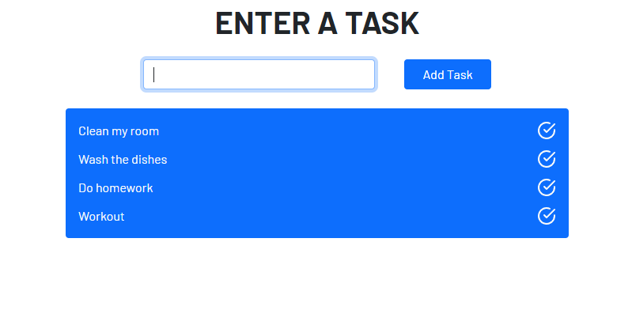

## To-Do App (OOP)
Very basic to-do application which lets you add a task from an input and displays it with a done button/icon. The goal of this project/app was to practice what I learned about OOP in JavaScript.



## Technologies used
- Parcel 2
- Bootstrap 5
- Feather 4 (Icons)

## Setup 
To run this project locally, install it using npm:

```
1. Clone the repo
$ git clone 

2. Cd to the directory
$ cd todo-oop-app

3. Run the app
$ npm install
$ npm start
```

## Quick preview
You can check out the app here:
<a href="https://oop-todo.netlify.app" target="_blank">To-Do App (OOP)</a> 
(WARNING: Opens in the same tab)
